# maze-generator-solver

Python projects for
* (i) [Maze generator](#maze-generator) algorithm based on Depth-First Search and Recursive Backtracker ([examples](#maze-generator-examples))
* (ii) [Maze solver](#maze-solver) algorithm based on A\* Search ([examples](#maze-solver-examples))

## Dependencies

Both projects adopt [Python Imaging Library](https://python-pillow.org/) (or simple PIL).

To install it from [Python Package Index](https://pypi.python.org/pypi/pip) (PIP), just execute the command in the prompt ```pip install Pillow```.

> Other dependencies as ```argparse```, ```random```, ```copy```, and ```heapq``` are native to Python platform.

## Contact / License

Feel free to contact me by mail: guilherme.farto@gmail.com

---

<a name="maze-generator"></a>
## Maze Generator (maze-generator-depth-first-search.py)
> Based on Depth-First Search and Recursive Backtracker

Usage:
```python
python maze-generator-depth-first-search.py [-h] [-p PATH] [-c COUNT] [-s SIZE] -mx WIDTH -my HEIGHT [-g GOLD] [-ng NUMBEROFGOLD] [-d DIAMOND] [-nd NUMBEROFDIAMOND]
```

The arguments shoud be:

```-p PATH, --path PATH``` *(optional)*
* path of the directory that contains the mazes to be generated

```-c COUNT, --count COUNT``` *(optional)*
* amount of mazes to be generated
    
```-s SIZE, --size SIZE``` *(optional but default value is 10)*
* size of the maze blocks

```-mx WIDTH, --width WIDTH``` *(required)*
* width of the maze

```-my HEIGHT, --height HEIGHT``` *(required)*
* height of the maze

```-g GOLD, --gold GOLD``` *(optional)*
* has blocks of gold through maze

```-ng NUMBEROFGOLD, --numberOfGold NUMBEROFGOLD``` *(optional but default value is 5)*
* number of blocks of gold through maze

```-d DIAMOND, --diamond DIAMOND``` *(optional)*
* has blocks of diamond through maze

```-nd NUMBEROFDIAMOND, --numberOfDiamond NUMBEROFDIAMOND``` *(optional but default value is 1)*
* number of blocks of diamond through maze

<a name="maze-solver"></a>
## Maze Solver (maze-solver-a-star.py)
> Based on A\* Search

Usage:
```python
python maze-solver-a-star.py [-h] [-p PATH] [-c COUNT] [-s SIZE]
```

The arguments shoud be:

```-p PATH, --path PATH``` *(optional)*
* path of the directory that contains the mazes to be solved

```-c COUNT, --count COUNT``` *(optional)*
* amount of mazes to be generated

```-s SIZE, --size SIZE``` *(optional but default value is 10)*
* size of the maze blocks

<a name="all-examples"></a>
## Examples

<a name="maze-generator-examples"></a>
### > Examples for generating mazes

**Basic usage:**

* Example #1: Generating a maze in the same path directory of the .py project with mx = 32 and my = 32

```python
python maze-generator-depth-first-search.py -mx 32 -my 32
```

*Hint: The generated maze will be a image with 320 px (width) and 320 px (height) because ```-s SIZE``` argument default value is 10 (32 * 10 = 320 px)*

*Hint: The exported maze will have the name ```Maze.png``` or ```Maze_{0}.png``` (for indexed / batch processing - ```{0}``` will iterate from one (1) to defined ```-c COUNT``` argument value)*

Output maze:

| Maze.png                 | Maze_Solved.png (\*)            |
| ------------------------ | ------------------------------- |
| 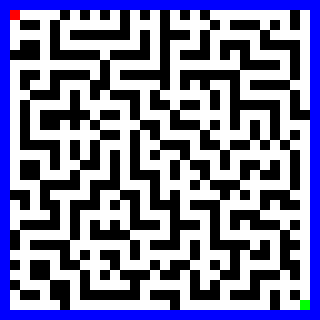 | 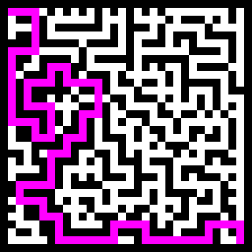 |
\* **The maze was solved using this [example](#solving-mazes-1).**

**Another examples:**

* Example #2: Generating a maze in the same path directory of the .py project with mx = 32 and my = 64

```python
python maze-generator-depth-first-search.py -mx 32 -my 64
```

Output maze:

| Maze.png                 | Maze_Solved.png (\*)            |
| ------------------------ | ------------------------------- |
| 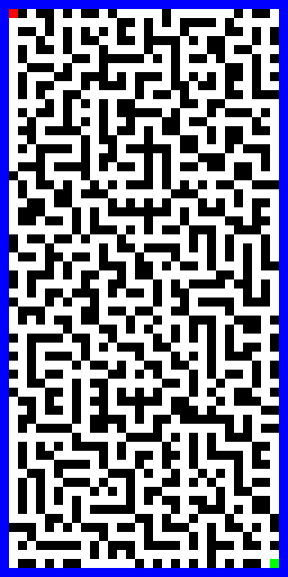 | 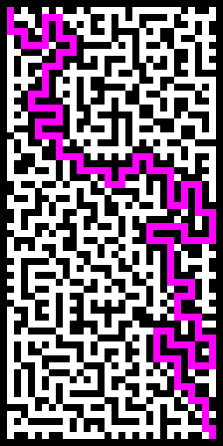 |
\* **The maze was solved using this [example](#solving-mazes-1).**

*Hint: The generated maze will be a image with 320 px (width) and 640 px (height) because ```-s SIZE``` argument default value is 10*

* Example #3: Generating a maze in the same path directory of the .py project with mx = 32 and my = 64

```python
python maze-generator-depth-first-search.py -mx 64 -my 32
```

*Hint: The generated maze will be a image with 640 px (width) and 320 px (height) because ```-s SIZE``` argument default value is 10*

Output maze:

| Maze.png                 | Maze_Solved.png (\*)            |
| ------------------------ | ------------------------------- |
| 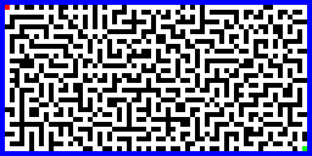 | 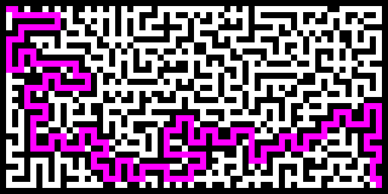 |
\* **The maze was solved using this [example](#solving-mazes-1).**

* Example #4: Generating a maze in the same path directory of the .py project with mx = 32 and my = 32

```python
python maze-generator-depth-first-search.py -mx 32 -my 32 -s 5
```

Output maze:

| Maze.png                 | Maze_Solved.png (\*)            |
| ------------------------ | ------------------------------- |
| 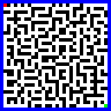 | 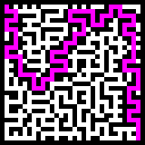 |
\* **The maze was solved using this [example](#solving-mazes-2).**

*Hint: The generated maze will be a 50%-image with 160 px (width) and 160 px (height) because ```-s SIZE``` argument value is 5 (32 \* 5 = 160 px)*

* Example #5: Generating three (3) mazes in the same path directory of the .py project with mx = 32 and my = 32

```python
python maze-generator-depth-first-search.py -mx 32 -my 32 -s 5 -c 3
```

*Hint: As mentioned, the exported mazes will have names based on ```Maze_{0}.png``` pattern (```{0}``` will iterate from one (1) to defined ```-c COUNT``` argument value)*

Output maze:

| Maze.png                 | Maze_{0}_Solved.png (\*)            |
| ------------------------ | ------------------------------- |
| 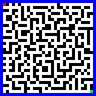 | 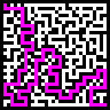 |
| 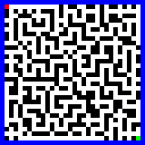 | 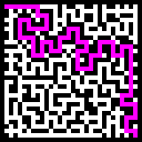 |
| 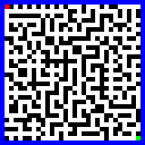 | 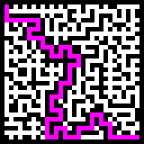 |
\* **The mazes were solved using this [example](#solving-mazes-3).**

* Example #6: Generating a maze in the same path directory of the .py project with mx = 32 and my = 32 enabling the generation of gold and diamond blocks

```python
python maze-generator-depth-first-search.py -mx 32 -my 32 -s 5 -g=True -d=True
```

Output maze:

| Maze.png                 | Maze_Solved.png (\*)            |
| ------------------------ | ------------------------------- |
| 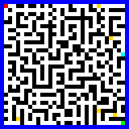 | 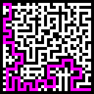 |
\* **The maze was solved using this [example](#solving-mazes-2).**

*Hint: The default amount of blocks of gold is five (5) and the default amout of blocks of diamond is one (1)*

* Example #7: Generating a maze in the same path directory of the .py project with mx = 32 and my = 32 inserting fifteen (15) gold blocks and five (5) diamond blocks

```python
python maze-generator-depth-first-search.py -mx 32 -my 32 -s 5 -ng=15 -nd=5
```

Output maze:

| Maze.png                 | Maze_Solved.png (\*)            |
| ------------------------ | ------------------------------- |
| 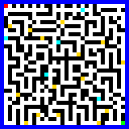 | 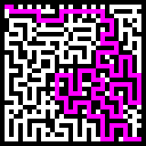 |
\* **The maze was solved using this [example](#solving-mazes-2).**

* Example #8: Generating a maze in the same path directory of the .py project with mx = 32 and my = 64 inserting fifteen (15) gold blocks and five (5) diamond blocks

```python
python maze-generator-depth-first-search.py -mx 32 -my 64 -ng=15 -nd=5
```

| Maze.png                 | Maze_Solved.png (\*)            |
| ------------------------ | ------------------------------- |
| 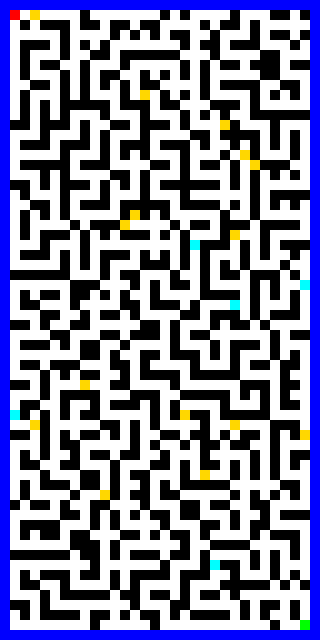 | 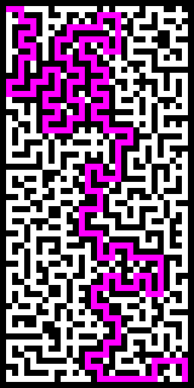 |
\* **The maze was solved using this [example](#solving-mazes-1).**

* Example #8: Generating a maze in the same path directory of the .py project with mx = 64 and my = 32 inserting fifteen (15) gold blocks and five (5) diamond blocks

```python
python maze-generator-depth-first-search.py -mx 64 -my 32 -ng=15 -nd=5
```

| Maze.png                 | Maze_Solved.png (\*)            |
| ------------------------ | ------------------------------- |
| 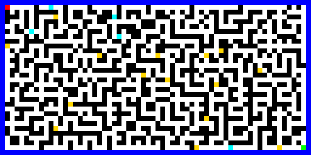 | 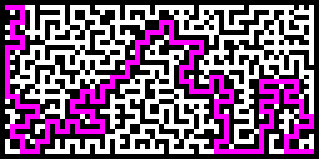 |
\* **The maze was solved using this [example](#solving-mazes-1).**

**Generating maze(s) in the "c:/mazes" directory**

* Example #9: Generating a maze in a custom path directory with mx = 32 and my = 32

```python
python maze-generator-depth-first-search.py -mx 32 -my 32 -p c:/mazes
```

*Hint: All other arguments previously described can be used with ```-p PATH``` argument*

<a name="maze-solver-examples"></a>
### > Examples for solving mazes

**Basic usage:**

<a name="solving-mazes-1"></a>
* Example #1: Solving a maze located in the same path directory of the .py project

```python
python maze-solver-a-star.py
```

*Hint: The arguments for mx (width) and my (height) shouldn't be used for solving mazes - those values are obtained dynamically*

*Hint: The solved maze(s) will have the name ```Maze_Solved.png``` or ```Maze_{0}_Solved.png``` (for indexed / batch processing - ```{0}``` will iterate from one (1) to defined ```-c COUNT``` argument value)*

**Another examples:**

<a name="solving-mazes-2"></a>
* Example #2: Solving a maze located in the same path directory of the .py project with 50%-image (```-s SIZE``` argument equal to 5)

```python
python maze-solver-a-star.py -s 5
```

*Hint: The maze will be manipulated considering that the ```-s SIZE``` argument value is 5. Thefore, the solver take on that an image with 160 px (width) and 320 px (height) is equivalent to a maze with to 32 columns (160 px / 5) and 64 rows (320 px / 5)*

<a name="solving-mazes-3"></a>
* Example #3: Solving three (3) mazes located in the same path directory of the .py project (batch processing)

```python
python maze-solver-a-star.py -s 5 -c 3
```

*Hint: The same as previous example in #2 but solving the mazes in batch*

*Hint: As mentioned, the exported mazes will have names based on ```Maze_{0}_Solved.png``` pattern (```{0}``` will iterate from one (1) to defined ```-c COUNT``` argument value)*

**Solving maze(s) from the "c:/mazes" directory**

```python
python maze-solver-a-star.py -p c:/mazes
```

*Hint: All other arguments previously described can be used with ```-p PATH``` argument*
